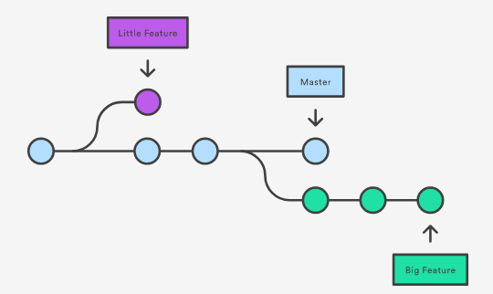

# Git

## Commands
#### git init
- `git init`: Initialize the current directory to a git repo.
- `git init <dirc-name>`: Initialize the specific directory or create new one if don't exist.
- Converts an existing project to a *git repo* or create a new empty *repository*.
- Creates a subdirectory **'.git'** containing the metadata for the repository
- `git init --bare <directory-location>`
  - Creates a bare repository.
  - You can't edit or commit to Bare repository.
  - Only Push and Pull is allowed.
  - Non-working directory.
  - Can act as Central Directory.

#### git clone
- `git clone <path-to-rep-to-be-cloned.git>`
- `git clone <path-to-rep-to-be-cloned.git> <folder-to-which-cloned>`
- Initialize a new empty repository and then copy the contents of the remote/local repository which is cloned.
- Creates a remote connection k/a **origin** which points to the original repository.

#### git config
- Used to read or write from/to configuation files.
- Three scope levels
  - local, global, system
- Inside Config file, we have
  - Sections, under section Key,value pairs
    - [section]
      - KEY=value
    - [user]
      - email=manishrathi1503@gmail.com
- `git config --<scope> <section>.<key> <value>`
  - `git config --local user.email 'manish@gmail.com'`
- Use for creating aliases
  - `git conifg --local alias.ci commit`

#### git add
- `git add <file-name>` or `git add <dirc-name>`
- It promotes(adds) pending changes in the working directory to the staging area.
- These are the changes that you want to include in the next commit.
- Staging area: Intermediate storage area.

#### git commit
- Commits can be thought of as snapshots or milestones along the timeline of a Git project.
- *git commit* command captures the state(snapshot) of a project at that point in time. In other words, it commits the staged snapshot.
- `git commit --amend`
  - It save the staged changes in the previous commit instead of new commit.
- `git commit -a`
  - It commit changes in all the tracked files( whether changes of tracked files are staged or not).
- `git commit -m 'commit-message'`

#### git diff
- It runs a *diff* function on *git data sources*. Data sources can be commits, branches, files.
- `git diff`
  - show all the unstaged changes in the working repository.
- `git diff --cached` or `git diff --staged`
  - Compares staged changes with local repository.
  - Show all the staged changes in the working directory.
- `git diff <file-name>`
  - compare changes in particular file.
- `git diff --color-words`
  - Displays only the words that have changed in color coded format.
- `git diff COMMIT-ID-1 COMMIT-ID-2`
  - Compare two commits
- `git diff BRANCH-1 BRANCH-2`
  - Compare two branches
- `git diff BRANCH-1 BRANCH-2 <file-name>`
  - Compare particular file in two branches

#### git stash
- It temporarly shelves(or stashes) changes in the current working repo.
  - Simply saying, it move the changes to some special place.
  - After this we can work on something else in repository, make changes, create branches, make commits, anything we want.
  - Then the stashed changes can be reapplied to repository.
- `git stash`
  - Stashes all the changes except untracked files and ignored Files.
  - Include Tracked files
- `git stash -u`
  - Include Tracked files + untracked files
- `git stash -a` or `git stash -all`
  - Include Tracked files + untracked files + ignored files.
- `git stash pop`
  - Remove the changes from stash and reapply them.
  - Reapplies the most recent stash.
- `git stash pop stash@{2}`
  - Reapply the particular stash with id *stash@{2}*
- `git stash apply`
  - Reapply the changes but don't remove from stash
- `git stash list`
  - List all the stashes
- `git stash save "message"`
  - Stash changes with a *message*
- `git stash show`
  - We can view stash diff, means we can see which changes are stashed but a summary of changes only.
- `git stash show -p`
  - WE can see detailed information of changes which are stashed.
- `git stash -p`
  - This will iterate through every chunk which is changed in our working copy and ask what we want to do with it
  - Option [ y, n , s, q]
    - y : yes, stash this current chunk
    - n : no, don't stash
    - s : split this chunk into smaller chunks
    - q : quit, already selected chunks will be stashed.
- `git stash branch <branch-name> stash@{1}`
  - This will create a new branch 'branch-name' based on the commit  on which we created our stash, 'stash-id'. Then it pops the stashed changes onto this branch.
- `git stash drop stash@{1}`
  - This will delete the particular stash
- `git stash clear`
  - This will delete all the stashes.

#### .gitignore
- *.gitignore* is a file you will find at the root of your repository
  - This file contains patterns, these patterns are matched with names of files in the repository and the file which match are ignored.
- *.gitignore* is just a normal file that can be committed or pushed, it will not be ignored.
- It will be **shared** along with repository
- `git check-ignore -v myfile`
- This checks due to which pattern this *myfile* is getting ignored.

#### .git/info/exclude
- This file is not versioned and will not distributed with our repository i.e it stays in our local system only.
- Here you can include the local patterns for ignoring files, these patterns will only benefit the **local** user.

#### global git ignore rules
- Here we will create a *.gitignore* file that contains patterns for all the repos of local system
- You can put this global *.gitignore* file in the home directory
- After that you have to set `core.excludesFile` property value equal to path of this global *.gitignore* file, on global scope.
- `git config --global core.excludesFile=~/.gitignore`

#### ignoring previously committed file
- First, delete the file from the repository, then add a rule for it in *.gitignore* file
- Say file name is *debug.log* which we want to ignore
- Write it rule for it
- echo 'debug.log' > .gitignore
- Delete it
- `git rm --cached debug.log`
  - Using --cached option will delete the file from the repository but file will stay in working directory as ignored file.
- Not using --cached option will delete the file from repo as well as local directory.

#### Committing ignored file
- `git add -f debug.log`
- Or by adding a negation rule for this file in the *.gitignore* file(best option).

#### git status
  - It shows the state of working directory and staging area
  - It give list of staged, unstaged and untracked files or simply saying it tells us which files are staged, unstaged and untracked.

#### git log
- It lists the commit history or say displays the committed snapshots.
- `git log --oneline`
  - List all the commits in a condense form, 1 commit in 1 line.
- `git log -n <limit>`
  - It lists the last 'limit' no. of commits only
- `git log <file-name>`
  - It lists the commits that includes this file.
- `git log -p`
  - It gives the detailed view of each commit
- `git log --author="freebird"`
  - List all the commits by this author
- `git log --grep="pattern/regex"`
  - List all the commits which have this *pattern/regex* in their commit message
- `git log <since>..<until>`
  - Show all the commits that occur b/w '<since>' and '<until>'
  - Both arguments can be either a commit ID, a branch name, HEAD, or any other kind of revision reference.

#### git remote
- It helps to create, view and delete remote connections with other repositories.
- **Remote Connections**: Connections to other repositories. These are basically 'names' that refer to URL of some remote repository, so that we don't have to write the URL all the time.
- Remote connections entries are stored in a file:- **./.git/.config**
- `git remote`
  - List all the remote connections in *.config* file.
- `git remote -v`
  - List all the remote connection names + URL
- `git remote add <name> <url>`
  - Add a new remote connection with its name and url.
- `git remote rm <name>`
  - Remove the remote connection of a particular name from *.config* file.
- `git rename <old-name> <new-name>`
  - Rename a remote connection
- `git remote GET-URL <connection-name>`
  - Show the url of remote connection.
- `git remote PRUNE <connection-name>`
  - Delete all the local branches which are not present in the remote repository.
  - Option:  **- -dry-run**
    - List all the branches which are not present in remote repo but will not prune/delete them.
- **Origin** - Remote Connection
  - When we clone a repository, *origin* remote connection is automatically created.
  - It points back to the cloned repository.
  - It provides an easy way to pull and push commits/changes.
  - Once the remote connection record is configured, then 'name' of remote connection can be used in other commands to communicate with the remote repos.

#### git push
- To push/export the local commits/changes to remote repository
- `git push <remote-name> <branch-name>`
  - Push the specified 'branch' to 'remote-name' repository.
- Git won't let us push when it results in **non-fast-forward-merges** in remote repo.
- `git push <remote> <branch> --force`
  - Force push even if there is *non-fast-forward-merge*
- `git push <remote> --all`
  - Push all the branches to 'remote'.
- If the remote history has diverged from your history, you need to pull the remote branch and merge it into your local one, then try pushing again, otherwise ***non-fast-forward-merge*** conflict occurs.
- `git push <remote-name> --delete <branch-name>`
  - Delete the remote branch
- `git push <remote-name> :<branch-name>`
  - Delete the remote branch

#### git branch
- It allows us to *create, view, rename, delete* branches.
- `git branch` or `git branch --list`
  - List all the branch **names/refs** in local working directory.
  - Local branch refs live in directory **./.git/refs/heads/**.
- `git branch -r`
  - List all the remote + local branch **names/refs**.
  - Remote branch refs live in directory **./.git/refs/remote/**.
- `git branch <branch-name>`
  - Create a new branch
- `git branch -d <branch-name>`
  - Deletes the branch safely.
  - It prevents us from deleting branch if it has unmerged changes.
- `git branch -D <branch-name>`
  - Forcefully deletes the branch.
- `git branch -m <new-branch-name>`
  - renames the current branch.
- `git branch -a`
  - List all remote branches.
- Creating Remote Branches
  - Create branch locally then push it to remote connection.
  - `git branch crazy-experiment`
  - `git push <remote-name> <branch-name>`
    - E.g: *git push origin crazy-experiment*
- Deleting Remote BRANCH
  - `git push <remote-name> --delete <branch-name>`
  - `git push <remote-name> :<branch-name>`
  - E.g: *git push origin --delete crazy-experiment*

#### git checkout
- Switch between *files, commits, branches*
- Switching between Branches
  - Selecting Different line of development.
  - Checking out to a branch, updates the contents of working directory with the ones that match with the corresponding branch.
  - `git checkout <branch-name>`
    - Switch to a already existing branch
    - **HEAD** will point to the corresponding branch now.
  - `git checkout <remote>/<branch-name>`
    - To inspect/checkout the fetched branch from remote connection.
    - HEAD will be in detached state here.
  - `git checkout -b <branch-name>`
    - First creates the branch, then switch to the branch.
    - Base branch on which new branch will be created here is current branch.
  - `git checkout -b <new-branch-name> <base-branch-name>`
    - Creates and switches to new branch.
    - New branch will be created based on the specified 'base branch'.
  - **Checkout a remote branch**
    - ?

#### git fetch
  - This will download all the *commits, branches, refs* from a remote repository.
  - Git isolates/separate Fetched content and local content.
  - Fetched content need to be explicitly checkout and merge.
  - Fetching is a safe way to review commits before integrating them to our local repository.
  - `git fetch <remote>`
    - Fetches/downloads all the branches, commits & files from the remote repository.
  - `git fetch <remote> <branch-name>`
    - Only fetch the specified branch and its files & commits.
    - `git log --oneline <remote>/<branch-name>`
      - List all the commits specific remote and its branch.
    - `git log --oneline master..origin/master`
      - List all the commits between the local master and upstream master.
    - `git checkout <remote>/<branch-name>`
      - To inspect/checkout the fetched branch from remote connection.
      - HEAD will be in detached state here.
    - `git merge <remote>/<branch-name>`
      - Merge the remote branch with local repository.
  - `git fetch --all`
    - Fetch all the branches from all the registered remotes.

#### git pull
- To pull a specific branch first checkout to the local copy of that branch then perform *git pull*.
- Two Steps (*git fetch + git merge*)
  - Fetch the content from remote repository corresponding to the branch to which local HEAD is pointing.
  - Enter a merge workflow. A **new merge commit** will be created and HEAD updated to point at the new commit.
- `git pull <remote>`
  - Fetch the specified remote’s copy of the current branch and immediately merge it into the local copy.
  - Create a new merge commit.
- `git pull <remote> <branch-name>`
  - Fetch the specified remote's copy of the specified branch and try to merge it with current local branch.
  - Create a new merge commit.
- `git pull --no-commit <remote>`
  - Similar to default pull but does not create a **merge commit**.
- `git pull --rebase <remote>`
  - Instead of using git merge to integrate the remote branch with the local one, use git rebase
- `git pull --verbose <remote>`
  - Gives verbose output during a pull which displays the content being downloaded and the merge details.
  - **I saw no difference b/w this and default option.**

### git merge
- To merge the divided/forked history of a branch together.
  - Say User1 made some changes in master branch and User2 made its own changes in the master branch, so now we can merge this divided history using *git merge*.
  - Generally used after  **git fetch**
  - E.g
    - `git fetch origin <branch-name>`
    - `git checkout master`
      - Checkout to the local branch with which you want to merge the remote branch changes.
    - `git merge origin/<branch-name>`
  - If 2 users changed the same line of a file, then lead to merge conflict.
- To merge two different branches together.
  - git merge takes two commit pointers, usually the branch tips, and will find a common base commit between them. Once Git finds a common base commit it will create a new "merge commit" that combines the changes of each queued merge commit sequence.
  - **Merge commits** are unique against other commits in the fact that they have two parent commits. When creating a merge commit Git will attempt to auto magically merge the separate histories for you.
  - `git merge <branch-to-be-merged>`
    - Receiving branch --> current branch
    - Merge Branch --> 'branch-to-be-merged'
  - Before Merging Branch
    - All branches must be up-to-date with remote changes.
      - Use *git fetch* or *git pull* to update both the branches which are going to be merged.
  - In fast forward merge there is no **merge commit**
    - Adding merge commit in fast forward merged
      - `git merge --no-ff <branch-to-merge>`
      - This commmand generate a merge commit for future reference.
  - Non-fast forward merge requires 3 way merge.

### merge conflicts
- Conflicts generally arise when two developers have changed the same lines in a file, or if one developer deleted a file while another developer was modifying it.
- It occurs always in 3-way merge.
- `git merge` will enter conflict in 2 situations
  - Start of merging process
    - Git fails to start the merge, when there are changes in the working directory or staging area i.e changes are not commited. These changes will be overwritten that's why git merge fails to prevend this.
    - Need to stablize the local state using `git stash, git commit, git checkout, git reset`.
    - Conflict due to its local state not due to other branch.
  - During the Merge process.
    - Conflict due to other branch. Same line is modified in both branches.
- Identifying Conflict
  - `git status`
    - Used to identify conflict and conflicting file.
    - Files under heading **Unmerged Paths** of `git status` are having conflict.
- Examining the Conflicted file
  - Conflicted file will have special patterns to mark conflict
    - `<<<<<<<<< HEAD`: Start of conflict
    - `=========`: Conflict divider.
      - Before this divider content belongs to current branch
      - After this, content belongs to branch-to-merged.
    - `>>>>>>>>> branch-to-merged-name`: End of conflict
- Resolving the conflict
  - Edit the file manually.
  - Select one of the two content which is causing conflict and delete the other one
  - Delete the conflict markers.(<<<<<HEAD, ====, >>>>branch-name)
  - After that use `git add file-name`, to stage changes
  - Create a new merge commit `git commit -m 'message'`
    - Git will see that the conflict has been resolved and creates a new merge commit to finale the merge.
  - Conflict Resolved, branches merged.
- Useful commands used along with `git merge`
    - `git log --merge`
      - List all the commits that are conflicting b/w the branches.
    - `git reset --mixed`
      - Undo changes to the local working directory and staging area. Avoid *merge fail error at start of merge process*.

- `git merge --abort`
  - Exit the merge process.
- 

## Concepts
- **3 trees of Git**
  - Working directory
  - Staging area
  - Commit History
- **Staging Area**
  - Intermediate storage area between working directory and commit History.
- **Tracked Files**
  - Those which are added using *git add* at some point of time.
- **HEAD**
  - It acts as *pointer/reference* that *points/refers* to current snapshot of repository.
  - When we checkout a branch/commit.
    - HEAD points to the specified branch/commit now.
- **Detached Head**
  - When we checkout a commit.
    - HEAD points to the specified commit and in this case, it is said to be in 'detached' state and k/a **DETACHED HEAD**
- **Branches**
  - **Branch**: It is a indepenent line of development.
  - Each Branch has its own brand new *working directory, staging area, History.*
  - With each commit, there is a branch associated with it.
  - When we create a branch, git makes a new pointer for the corresponding branch. This branch pointer will point to(associated with) new commits we will make.
  - New commits are recorded in the history for the current branch, which results in a fork in the history of the project(fork means divide, here timeline of project gets divided).
  - 
- **Checkout**
  - It is act of switching between different versions of target entity.
- **Fast forward merge**
  - When we want to merge two branches and there is a linear path from the current branch tip to the target branch.
  - All Git has to do to integrate the histories is move (i.e., “fast forward”) the current branch tip up to the target branch tip.
- **Non fast forward merge**
  - When two branches we want to merge are diverged i.e there is non linear path between them, then git has no choice but to use **3 way merge**
  - Happens when master and feature-branch both progresses in their development line.
- **3 way merge**
  - 3-way merges use a dedicated commit to tie together the two histories.
  - The nomenclature comes from the fact that Git uses three commits to generate the merge commit: the two branch tips and their common ancestor.
